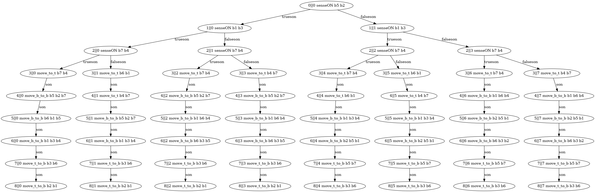

# PDDL Executor
This library provides a PDDL-to-C++ conversion tool that allows you to decrease runtime by "compiling" PDDL (Planning Domain Definition Language) text into a C++ interface. By converting PDDL into C++, you can benefit from the performance optimizations and compile-time checks provided by the C++ programming language.

## Features
PDDL Executor: The library includes functionality to generate C++ behavior trees from PDDL with sensing actions. 
The pipeline is broken into several phase. First, a planning problem and domain must be constructed with PDDL. 
Then the PDDL is parsed with provided the Python package and converted into a C++ with codegen. 
The generated code implements an `expand` method to generate successor state from an initial state. 
It also provides a `initialize_problem` function to help setup the problem instance. A planner is provided, 
but it would be easy to reuse the basic framework with a custom planner. See below for a plan generated from the 
block world domain.        

  

Once a plan is found at runtime, it is converted into a behavior tree encoded and then executed. Notable, codegen is 
used again to generate a C++ interface that is used by the behavior tree. Essentially, the interface contains 
function for all actions in the PDDL domain, which need to implemented.          

## Run
Run the following command from the project root to generate a sample plan. Note the first run is slower because it compiles the PDDL.

`ros2 run plan_solver_py plan_solver -o $(pwd)/plan_solver_py/plan_solver/pddl/domain_blocks.pddl -f $(pwd)/plan_solver_py/plan_solver/pddl/problem_blocks.pddl`

Then run the following command visualize the plan graph

`ros2 run plan_solver_py plan_graph`